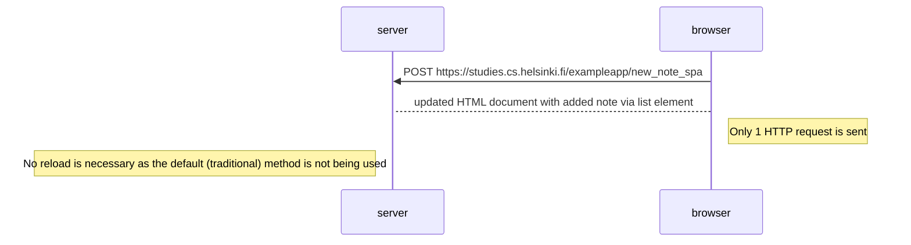

```mermaid
sequenceDiagram
    participant server
    participant browser

    browser->>server: POST https://studies.cs.helsinki.fi/exampleapp/new_note_spa
    activate server
    server-->browser: updated HTML document with added note via list element

    Note right of browser: Only 1 HTTP request is sent
    
    Note left of server: No reload is necessary as the default (traditional) method is not being used
```